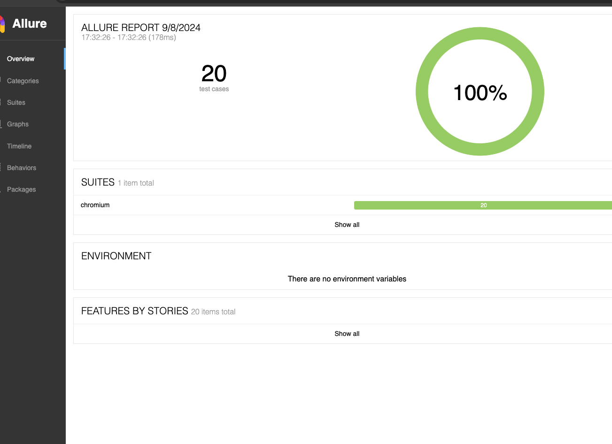

# API Testing with Playwright

This project contains automated tests for various APIs, including User Creation, Deposit, Withdrawal, Get Balance, and Send Money functionalities. The tests are implemented using Playwright with JS and mock the backend using MockServer.

## Backend Simulation

We use [MockServer](https://www.mock-server.com/) to simulate API responses. MockServer is set up with Docker Compose.

### Setup

1. **Clone the Repository:**

   ```sh
   git clone https://github.com/your-repo/your-project.git
   cd your-project
   ```

   **Note** : mock server operates on port 1080 with dashboard url http://localhost:1080/mockserver/dashboard

2. **Install Dependencies: Ensure Node.js is installed, then run:**
   ```sh
   npm install
   ```
3. **Start MockServer: Ensure Docker is installed and running, then in the project root directory, execute:**

   ```sh
   docker-compose up
   ```

4. **Run Tests: With MockServer running, execute:**

   ```sh
    npm test
   ```

5. **Allure Report Example**
   
